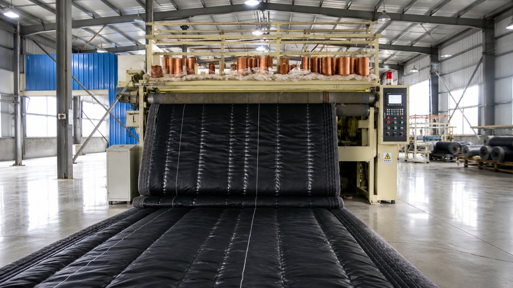

# 鑫源鼎丰农业科技有限公司 · 官方网站

专业蔬菜大棚保温棉被生产厂家官网。纯静态网站（HTML + CSS + JavaScript），**不依赖任何外部 CDN**，国内访问快、可直接用 GitHub Pages 免费上线。

- 🌐 中 / EN 一键切换，自动记住语言
- 📱 手机、平板、电脑自适应
- 🎨 自带 SVG Logo 与插画，零图片依赖（可随时替换为真实照片）
- 📨 留言表单已内嵌「金数据」在线表单：访客网页内直接填写提交、不跳转邮箱，消息由金数据后台收集并可短信/微信/邮件通知

---

## 一、目录结构

```
.
├── index.html              # 网站主页面（所有板块都在这里）
├── assets/
│   ├── css/style.css       # 全部样式（颜色、排版、动效）
│   ├── js/main.js          # 中英文词典 + 交互逻辑
│   └── img/logo.svg        # Logo（临时版，可替换）
├── .github/workflows/
│   └── deploy.yml          # 自动发布到 GitHub Pages 的流程
├── .nojekyll               # 让 GitHub Pages 原样发布静态文件
└── README.md               # 本说明
```

---

## 二、如何让网站上线（GitHub Pages，免费）

> 整个网站是纯静态文件，最简单的免费上线方式就是 GitHub Pages。

### 步骤
1. 先把当前开发分支 `claude/keen-goodall-c5ve07` 合并到 `main` 分支
   （在 GitHub 上发起一个 Pull Request 并合并即可）。
2. 打开仓库页面 → 顶部 **Settings（设置）** → 左侧 **Pages**。
3. 在 **Build and deployment → Source** 处选择 **GitHub Actions**。
4. 保存后，仓库里的自动发布流程（`.github/workflows/deploy.yml`）会运行，
   等待 1～2 分钟。
5. 发布成功后，网站地址为：

   ```
   https://liuyueqiang1.github.io/agricultural-technology-co.-ltd./
   ```

之后**只要往 `main` 分支提交改动，网站会自动更新**，无需再做任何操作。

> 备选方式：Settings → Pages → Source 选 **Deploy from a branch → main → /(root)**，
> 同样可以上线，效果一致。

---

## 三、如何修改网站文字（中 / 英）

所有可见文字都集中在 **`assets/js/main.js`** 顶部的 `I18N` 词典里，
每一条都有中文 `zh` 和英文 `en` 两个版本。例如：

```js
"hero.lead": {
  zh: "我们专注于温室大棚保温棉被的研发与生产……",
  en: "We develop and manufacture thermal insulation quilts……"
},
```

想改哪句话，直接改对应的 `zh` / `en` 文字、保存即可，**中英文都要记得改**。

> 页面 `index.html` 里默认显示的是中文，可作为不开 JavaScript 时的兜底；
> 如果你改了某句中文，建议 `index.html` 和 `main.js` 里的中文保持一致。

---

## 四、如何把插画换成真实照片

目前公司介绍、产品图用的是内置 SVG 插画（蓝绿色的示意图）。等你有了真实照片：

1. 把照片放进 `assets/img/` 文件夹（建议命名如 `factory.jpg`、`product-1.jpg`）。
2. 在 `index.html` 中找到对应的 `<svg ...>...</svg>` 整段，替换成：
   ```html
   
   ```
3. 保存提交即可。图片会自动按区域裁剪适配。

> 产品图建议尺寸 4:3（如 800×600），公司介绍图同样 4:3。

---

## 五、公司信息（如需修改）

| 项目 | 当前内容 | 位置 |
|------|----------|------|
| 公司名称 | 鑫源鼎丰农业科技有限公司 | `index.html` / `main.js` |
| 电话 | 153 0536 5338 | 搜索 `15305365338` |
| 邮箱 | lyq15684175732@163.com | 搜索 `lyq15684175732` |
| 地址 | 山东省青州市何官镇 | 搜索 `contact.addrValue` |
| 营业时间 | 周一至周日 8:00–18:00 | 搜索 `contact.hoursValue` |

---

## 六、留言表单（已接入金数据，真实可收消息）

留言表单已经**内嵌「金数据」在线表单**，访客在网页里直接填写、点「提交」即可，
**不跳转邮箱**，提交内容由金数据后台收集和通知。

- 当前接入的表单链接：`https://qqeiilgv.jsjform.com/f/wqNKlF`
- 嵌入位置：`index.html` 联系板块里的这一行
  ```html
  <iframe src="https://qqeiilgv.jsjform.com/f/wqNKlF?embedded=true" ...></iframe>
  ```

### 你需要在金数据后台做的事
1. 登录 [金数据 jinshuju.com](https://jinshuju.com)，打开这个表单。
2. 在 **设置 → 通知** 里打开「新数据提醒」（邮件 / 短信 / 微信），
   客户一提交你就能立刻收到。
3.（建议）把表单顶部那张**风景油画封面图删掉**：表单更简洁、和网站风格更搭，
   高度也会变短。删掉后如果表单明显变短，可同步把 `assets/css/style.css` 里
   `.contact__iframe-box iframe` 的 `height` 调小一点（桌面默认 1040px、手机默认 1080px）。

### 以后想换一个表单（金数据 / 麦客 / 问卷星均可）
只需把上面那行 `<iframe>` 的 `src` 换成新表单的嵌入地址即可，其余不用动。

> 提示：金数据表单内部文字固定为中文。网页切到英文时，表单上方说明已注明
> “表单为中文，英文客户可直接电话或邮件联系”，电话、邮箱就在表单左侧的卡片里。

---

## 七、几点提醒

- **备案**：如果以后想用国内服务器或自己的 `.com` 域名在国内正常打开，需要做 ICP 备案。
  目前用 GitHub Pages 上线无需备案即可访问（页脚备案号先留作"待备案"，备案后填上即可）。
- **自定义域名**：买了域名后，可在 Settings → Pages → Custom domain 绑定，并在 `index.html` 同级新增 `CNAME` 文件填写域名。
- **本地预览**：在项目根目录执行 `python3 -m http.server 8080`，浏览器打开 `http://localhost:8080` 即可预览。

---

如需新增板块（如新闻动态、案例展示、工程实拍等），按现有板块的写法复制一段即可，
或直接联系协助你建站的人继续完善。
